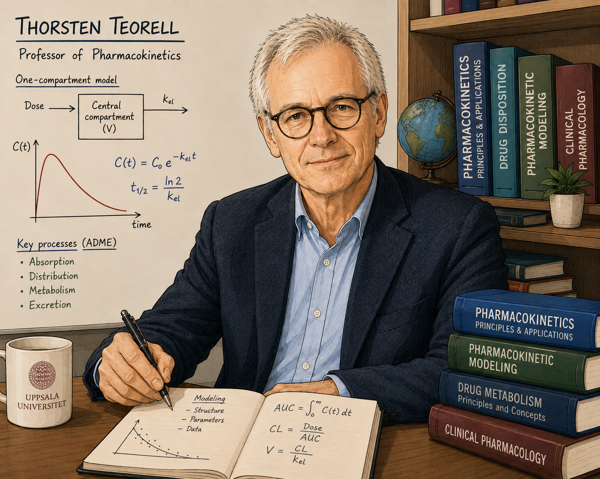

# teorell



FOSS core for pharmacokinetic modelling in anesthesiology & critical care.

Inspired by educational tools such as the [Brigham Anesthesia Simulator](https://apps.apple.com/us/app/brigham-anesthesia-simulator/id1406519095) (BAS): multi-drug IV PK, opioid equipotency, and a Bouillon-style predicted processed-EEG (BIS) surface.

## Status


| Area                    | Implemented           | Notes                                                                 |
| ----------------------- | --------------------- | --------------------------------------------------------------------- |
| IV PK engine            | Yes                   | 3-compartment mammillary + effect site; matrix-exponential integrator |
| Propofol                | Schnider              | Adult covariate model                                                 |
| Remifentanil            | Minto                 | Adult covariate model                                                 |
| Alfentanil              | Scott & Stanski       | Weight-scaled TCI form                                                |
| Volatile PK             | Gas Man–style         | Circuit + alveoli + VRG/muscle/fat (sevoflurane first)                |
| Predicted BIS           | Bouillon + Schumacher | IV opioids + propofol/sevoflurane hypnotic U                          |
| Opioid equipotency      | Alfentanil → remi     | ÷40 (Egan 1999 whole-blood ratio)                                     |
| Effect-site TCI         | No                    | Manual bolus/infusion / vaporizer schedules only                      |
| Live WebSocket UI       | Yes                   | `LiveSession` + FastAPI `/ws` + Vite React (`src/web/`)               |
| Docker Compose          | Yes                   | `docker compose up --build` → UI `:8080`, API `:8000`                 |
| NMB / local anesthetics | No                    | Catalogued below; not simulated yet                                   |


Phased plan for further volatiles and drugs: [ROADMAP.md](ROADMAP.md).

## Quick start

```bash
python3 -m venv .venv
source .venv/bin/activate
pip install -e ".[dev,live]"
pytest
./scripts/run-live.sh   # API :8000 + UI :5173
```

Open [http://localhost:5173](http://localhost:5173) — edit patient on the landing page → Start simulation.

```python
from teorell_core import (
    Bolus, Infusion, Patient, Regimen, SEVOFLURANE, Sex,
    VolatileSchedule, simulate_anesthesia, simulate_tiva,
)

patient = Patient(age=40, weight=70, height=170, sex=Sex.MALE)

# TIVA-only
tiva = simulate_tiva(
    patient,
    propofol=Regimen(boluses=(Bolus(0.0, 100.0),), infusions=(Infusion(1.0, 29.0, 6.0),)),
    remifentanil=Regimen(infusions=(Infusion(1.0, 29.0, 0.2),)),
    duration_min=30.0,
)

# Volatile ± IV (BAS dual-core)
anes = simulate_anesthesia(
    patient,
    propofol=Regimen(boluses=(Bolus(0.0, 80.0),)),
    volatile_agent=SEVOFLURANE,
    volatile_schedule=VolatileSchedule(segments=((0.0, 3.0, 6.0), (10.0, 1.5, 2.0))),
    duration_min=30.0,
)
print(anes.bis.min(), anes.mac_fraction.max(), anes.vrg_vol_pct[-1])
```


### Docker Compose

```bash
docker compose up --build
```

Open [http://localhost:8080](http://localhost:8080) (API health: [http://localhost:8000/health](http://localhost:8000/health)).  
Backend image embeds `teorell_core`; frontend is a static Vite build behind nginx with `/ws` proxy. See `docker/` and `compose.yaml`.

### Live app (FastAPI WebSocket + Vite React)

`./scripts/run-live.sh` starts FastAPI (WebSocket on `:8000`) and the Vite React UI (`:5173`) together. Requires Node/npm once; the script runs `npm install` in `src/web/frontend` if needed. Override ports with `API_PORT` / `WEB_PORT`.

Manual two-terminal setup:

```bash
# terminal 1 — API
PYTHONPATH=src uvicorn web.backend.main:app --reload --port 8000

# terminal 2 — UI
cd src/web/frontend && npm install && npm run dev
```


### Examples

```bash
python examples/schnider_bolus.py
python examples/schnider_bolus_infusion.py
python examples/schnider_multi_bolus_high_infusion.py
python examples/brigham_style_tiva_bis.py
python examples/brigham_style_propofol_alfentanil_bis.py
python examples/sevoflurane_gasman_bis.py
```


### Units


| Drug         | Dose / rate fields        | Concentration / tension          |
| ------------ | ------------------------- | -------------------------------- |
| Propofol     | mg, mg/min                | µg/mL (= mg/L)                   |
| Remifentanil | µg, µg/min                | ng/mL (= µg/L)                   |
| Alfentanil   | µg, µg/min                | ng/mL (= µg/L)                   |
| Volatiles    | vaporizer vol%, FGF L/min | FI / FA / VRG vol%; MAC fraction |


`Bolus.amount_mg` / `Infusion.rate_mg_per_min` are shared field names; for opioids pass **micrograms** (documented in `simulate_tiva`).

## How predicted BIS is computed

Matches the BAS educational architecture (Connor & Philip, STA 2019): **IV core** + **volatile core** → equipotency → response surfaces.

### TIVA-only (`simulate_tiva`)

1. Simulate propofol / remifentanil / alfentanil Ce.
2. `remi_eq = Ce_remi + Ce_alfentanil / 40`
3. Bouillon (2004) surface with C50p = 4.47 µg/mL, C50r = 19.3 ng/mL.


### Dual-core (`simulate_anesthesia`)

1. Volatile Gas Man PK → VRG tension (vol%).
2. Scale to sevoflurane-equivalent vol% (MAC or agent C50).
3. Schumacher (2009) hypnotic U (additive Greco):
  - `U_h = Ce_prop / 3.68 + sevo_eq / 1.53`
4. Opioid arm as remi-eq / 19.3; combine with Bouillon Minto Hill (β = 0 → `U = U_h + U_r`).
5. `BIS = 97.4 − 97.4 · U^1.43 / (1 + U^1.43)`

```text
U_h = Ce_propofol / 3.68 + sevo_eq / 1.53
U_r = remi_eq / 19.3
U   = (U_h + U_r) / (1 − βθ + βθ²)     # β = 0
BIS = E0 − Emax · U^γ / (1 + U^γ)
```


### Assumptions and caveats (verified)


| Assumption                                             | Source / check                         | Caveat                                                              |
| ------------------------------------------------------ | -------------------------------------- | ------------------------------------------------------------------- |
| Schnider propofol V/CL/Q + ke0 0.456                   | Schnider 1998; standard TCI ke0        | Adult volunteers; not Eleveld / Marsh                               |
| Minto remifentanil covariates                          | Minto 1997                             | LBM via James formula                                               |
| Scott alfentanil V1=2.19 L, CL=0.195 @ 70 kg; ke0 0.77 | Scott & Stanski 1987; Sigmond BJA 2013 | × (weight/70). **Not** Maitre                                       |
| Alfentanil:remifentanil = 40:1                         | Egan 1999 (whole-blood)                | Plasma-alf vs blood-remi ≈ 70:1                                     |
| Bouillon C50p=4.47 (TIVA-only path)                    | Bouillon 2004 / PAS                    | Differs from Schumacher C50p=3.68 when volatiles present            |
| Schumacher C50p=3.68, C50sevo=1.53                     | Schumacher 2009                        | Additive on BIS; clinical endpoints can be synergistic (Heyse 2012) |
| Gas Man body flows 75/20/5%                            | Educational defaults                   | Not a full vessel-poor / N₂O second-gas model yet                   |
| Predicted BIS ≠ monitor BIS                            | Model PD only                          | No EEG processing                                                   |


## Package layout

```text
src/
  teorell_core/        # PK/PD library
    patient.py, dosing.py, parameters.py, simulator.py
    pd.py              # Bouillon + Schumacher + CombinedBIS
    tiva.py            # simulate_tiva(...)
    anesthesia.py      # simulate_anesthesia(...) dual core
    live.py            # LiveSession stepper (real-time boluses)
    models/            # schnider / minto / scott
    volatile/
      properties.py    # λ, MAC (sevo, iso, des, halo)
      gasman.py        # simulate_volatile(...)
  web/                 # live teaching UI stack
    backend/main.py    # FastAPI WebSocket server
    frontend/          # Vite React UI
```


## Planned infusion models

Catalog of PK references to implement (only **bold** rows are coded today):


| Drug             | Model               | Reference                                                                                                                                                                              |
| ---------------- | ------------------- | -------------------------------------------------------------------------------------------------------------------------------------------------------------------------------------- |
| **Alfentanil**   | **Scott & Stanski** | [Decreased fentanyl and alfentanil dose requirements with age…](https://pubmed.ncbi.nlm.nih.gov/3100765/) Scott JC, Stanski DR. *J Pharmacol Exp Ther.* 1987;240:159-66. PMID: 3100765 |
| Atracurium       | Marathe et al.      | [Effect of thermal injury…](https://pubmed.ncbi.nlm.nih.gov/2719307/) *Anesthesiology.* 1989;70:752-5. PMID: 2719307                                                                   |
| Bupivacaine (IV) | Tucker & Mather     | [Pharmacology of local anaesthetic agents…](https://pubmed.ncbi.nlm.nih.gov/1148097/) *Br J Anaesth.* 1975;47 suppl:213-24. PMID: 1148097                                              |
| Cisatracurium    | Tran et al.         | [Pharmacokinetics and pharmacodynamics of cisatracurium…](https://pubmed.ncbi.nlm.nih.gov/9806701/) *Anesth Analg.* 1998;87:1158-63. PMID: 9806701                                     |
| D-Tubocurarine   | Gibaldi et al.      | [Kinetics of the elimination…](https://pubmed.ncbi.nlm.nih.gov/5011414/) *Anesthesiology.* 1972;36:213-8. PMID: 5011414                                                                |
| Diazepam         | Greenblatt et al.   | [Pharmacokinetic and electroencephalographic study…](https://pubmed.ncbi.nlm.nih.gov/2702793/) *Clin Pharmacol Ther.* 1989;45:356-65. PMID: 2702793                                    |
| Etidocaine (IV)  | Tucker & Mather     | [Pharmacology of local anaesthetic agents…](https://pubmed.ncbi.nlm.nih.gov/1148097/) *Br J Anaesth.* 1975;47 suppl:213-24. PMID: 1148097                                              |
| Fentanyl         | Shafer et al.       | [Pharmacokinetics of fentanyl…](https://pubmed.ncbi.nlm.nih.gov/2248388/) *Anesthesiology.* 1990;73:1091-102. PMID: 2248388                                                            |
| Fospropofol      | Fechner et al.      | [Pharmacokinetics… GPI 15715…](https://pubmed.ncbi.nlm.nih.gov/12883403/) *Anesthesiology.* 2003;99:303-13. PMID: 12883403                                                             |
| Hydromorphone    | Hill & Zacny        | [Comparing… hydromorphone and morphine…](https://pubmed.ncbi.nlm.nih.gov/11041313/) *Psychopharmacology.* 2000;152:1-9. PMID: 11041313                                                 |
| Lidocaine (IV)   | Rowland et al.      | [Disposition kinetics of lidocaine…](https://pubmed.ncbi.nlm.nih.gov/5285383/) *Ann N Y Acad Sci.* 1971;179:383-98. PMID: 5285383                                                      |
| Lorazepam        | Greenblatt et al.   | [Pharmacokinetics and bioavailability of… lorazepam…](https://pubmed.ncbi.nlm.nih.gov/31453/) *J Pharm Sci.* 1979;68:57-63. PMID: 31453                                                |
| Meperidine       | Qiao & Fung         | [Pharmacokinetic-pharmacodynamic modelling of meperidine…](https://pubmed.ncbi.nlm.nih.gov/8040932/) *J Vet Pharmacol Ther.* 1994;17:127-34. PMID: 8040932                             |
| Mepivacaine (IV) | Tucker & Mather     | [Pharmacology of local anaesthetic agents…](https://pubmed.ncbi.nlm.nih.gov/1148097/) *Br J Anaesth.* 1975;47 suppl:213-24. PMID: 1148097                                              |
| Methadone        | Inturrisi et al.    | [Pharmacokinetic-pharmacodynamic relationships of methadone…](https://pubmed.ncbi.nlm.nih.gov/2188771/) *Clin Pharmacol Ther.* 1990;47:565-77. PMID: 2188771                           |
| Midazolam        | Greenblatt et al.   | [Pharmacokinetic and electroencephalographic study…](https://pubmed.ncbi.nlm.nih.gov/2702793/) *Clin Pharmacol Ther.* 1989;45:356-65. PMID: 2702793                                    |
| Morphine         | Sarton et al.       | [Gender differences in morphine…](https://pubmed.ncbi.nlm.nih.gov/15088841/) *Adv Exp Med Biol.* 2003;523:71-80. PMID: 15088841                                                        |
| Pancuronium      | Rupp et al.         | [Pancuronium and vecuronium…](https://pubmed.ncbi.nlm.nih.gov/2886080/) *Anesthesiology.* 1987;67:45-9. PMID: 2886080                                                                  |
| **Propofol**     | **Schnider et al.** | [The influence of method of administration…](https://pubmed.ncbi.nlm.nih.gov/9605675/) *Anesthesiology.* 1998;88:1170-82. PMID: 9605675                                                |
| **Remifentanil** | **Minto et al.**    | [Influence of Age and Gender… Remifentanil…](https://pubmed.ncbi.nlm.nih.gov/9009935/) *Anesthesiology.* 1997;86:10-23. PMID: 9009935                                                  |
| Rocuronium       | Plaud et al.        | [Pharmacokinetics and pharmacodynamics of rocuronium…](https://pubmed.ncbi.nlm.nih.gov/7648768/) *Clin Pharmacol Ther.* 1995;58:185-91. PMID: 7648768                                  |
| Ropivacaine (IV) | Lee et al.          | [Disposition kinetics of ropivacaine…](https://pubmed.ncbi.nlm.nih.gov/2589653/) *Anesth Analg.* 1989;69:736-8. PMID: 2589653                                                          |
| Succinylcholine  | Roy et al.          | [Concentration-effect relation of succinylcholine…](https://pubmed.ncbi.nlm.nih.gov/12411790/) *Anesthesiology.* 2002;97:1082-92. PMID: 12411790                                       |
| Sufentanil       | Gepts et al.        | [Linearity of pharmacokinetics… sufentanil.](https://pubmed.ncbi.nlm.nih.gov/8533912/) *Anesthesiology.* 1995;83:1194-204. PMID: 8533912                                               |
| Thiopental       | Stanski & Maitre    | [Population pharmacokinetics… thiopental…](https://pubmed.ncbi.nlm.nih.gov/2310020/) *Anesthesiology.* 1990;72:412-22. PMID: 2310020                                                   |
| Vecuronium       | Rupp et al.         | [Pancuronium and vecuronium…](https://pubmed.ncbi.nlm.nih.gov/2886080/) *Anesthesiology.* 1987;67:45-9. PMID: 2886080                                                                  |


## Planned volatile models

λ / MAC tables exist for **sevoflurane**, **isoflurane**, **desflurane**, and **halothane**; Gas Man PK runs for any of them. Schumacher BIS C50 is measured for sevoflurane; other agents are MAC-scaled to sevo-equivalents.


| Drug            | Model                               | Reference                                                                                                                                  |
| --------------- | ----------------------------------- | ------------------------------------------------------------------------------------------------------------------------------------------ |
| **Desflurane**  | **Yasuda et al.** (λ); Gas Man PK   | [Solubility of I-653…](https://pubmed.ncbi.nlm.nih.gov/2774233/) *Anesth Analg.* 1989;69:370-3. PMID: 2774233                              |
| Enflurane       | Lowe                                | Partition coefficients… Lowe HJ. *Isoflurane NDA* 1975:2947.                                                                               |
| Ether           | Poulin & Krishnan                   | [A tissue composition-based algorithm…](https://pubmed.ncbi.nlm.nih.gov/8560465/) *Toxicol Appl Pharmacol.* 1996;136:126-30. PMID: 8560465 |
| **Halothane**   | **Larson / Yasuda** (λ); Gas Man PK | [The solubility of halothane…](https://pubmed.ncbi.nlm.nih.gov/14462522/) *Anesthesiology.* 1962;23:349-55. PMID: 14462522                 |
| **Isoflurane**  | **Yasuda et al.** (λ); Gas Man PK   | [Solubility of I-653…](https://pubmed.ncbi.nlm.nih.gov/2774233/) *Anesth Analg.* 1989;69:370-3. PMID: 2774233                              |
| **Sevoflurane** | **Yasuda + Schumacher BIS**         | [Solubility…](https://pubmed.ncbi.nlm.nih.gov/2774233/); [Schumacher 2009](https://pubmed.ncbi.nlm.nih.gov/19741484/)                      |
| Xenon           | O'Brien & Veall                     | [Partition coefficients… 133Xe.](https://pubmed.ncbi.nlm.nih.gov/4475429/) *Phys Med Biol.* 1974;19:472-5. PMID: 4475429                   |


## License

MIT — see `LICENSE`.